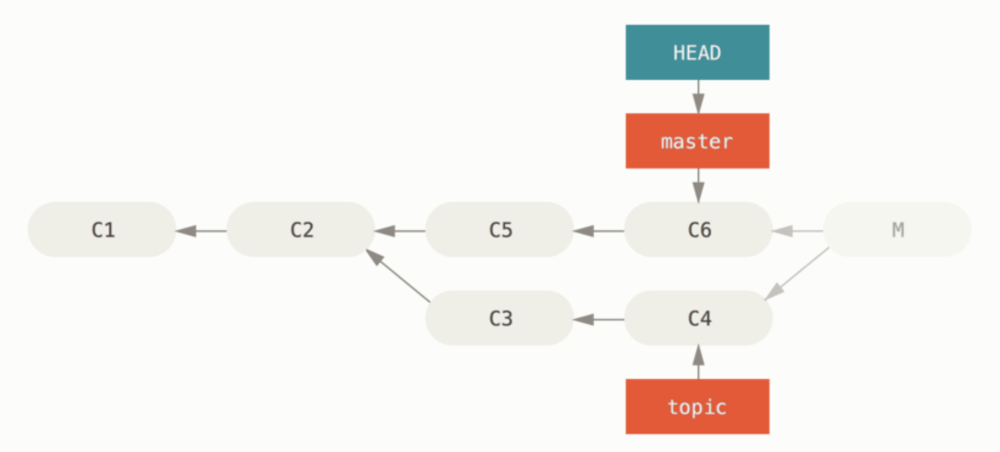
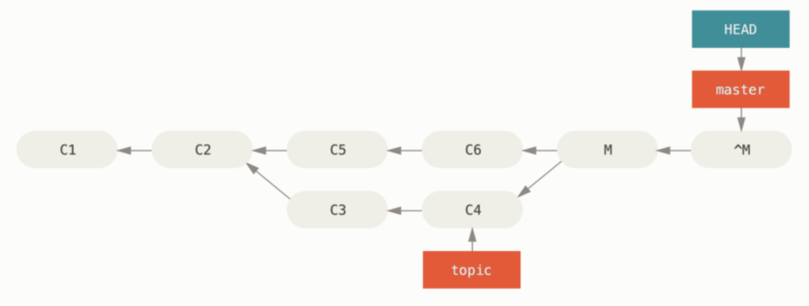

- 7.8 [Advanced Merging](https://git-scm.com/book/en/v2/Git-Tools-Advanced-Merging)
- 7.9 [Rerere](https://git-scm.com/book/en/v2/Git-Tools-Rerere)
- 7.11 [Submodules](https://git-scm.com/book/en/v2/Git-Tools-Submodules)
- 7.12 [Bundling](https://git-scm.com/book/en/v2/Git-Tools-Bundling)
- 7.13 [Replace](https://git-scm.com/book/en/v2/Git-Tools-Replace)
- 8.2 [Git Attributes](https://git-scm.com/book/en/v2/Customizing-Git-Git-Attributes)
- 8.4 [An Example Git-Enforced Policy](https://git-scm.com/book/en/v2/Customizing-Git-An-Example-Git-Enforced-Policy)

# 7.8 Advanced Merging

**Merge의 기본 철학**

- 브랜치 간 Merge는 자주 진행하고, 작은 충돌을 빠르게 해결하여 브랜치를 최신 상태로 유지하는 것이 중요하다.
- Git은 자동으로 충돌을 해결하려 하지 않으며, 사용자가 명확히 판단해 직접 해결하도록 설계되었다.

**Merge 충돌 처리 방법**

1. **충돌 발생 전 준비**:

- 워킹 디렉토리 정리(커밋 또는 Stash) 후 Merge 진행.
- 작업 중이던 파일이 있으면 충돌 시 일부 작업이 손실될 수 있음.

1. **충돌 해결**:

- **공백 무시 옵션**: 공백 변경으로 인한 충돌 시 -Xignore-all-space 또는 -Xignore-space-change 옵션 사용.
- **수동 해결**: Git에서 제공하는 파일 스테이지(:1:, :2:, :3:)를 활용하여 충돌을 직접 해결.

1. **Merge 중단 및 되돌리기**:

- git merge --abort로 Merge 이전 상태로 되돌림.
- 이미 저장되지 않은 파일은 복구 불가.

### Merge 되돌리기

**실수로 생긴 커밋이 로컬 저장소에만 있을 때: Refs 수정**

git reset --hard HEAD~: 최근 Merge 커밋을 삭제(히스토리 재작성 주의).



단점: 히스토리를 다시 쓴다는 것. 다시 쓰는 커밋이 이미 다른 사람들과 공유한 커밋이라면 `reset` 하지 않는 게 좋다. 이 방법은 Merge 하고 나서 다른 커밋을 생성했다면 제대로 동작하지 않는다. HEAD를 이동시키면 Merge 이후에 만든 커밋을 잃어버린다.

**커밋 되돌리기: revert**

브랜치를 옮기는 것을 할 수 없는 경우는 모든 변경사항을 취소하는 새로운 커밋을 만들 수도 있다.

```jsx
$ git revert -m 1 HEAD
[master b1d8379] Revert "Merge branch 'topic'"
```



### **서브트리 Merge**

프로젝트 두 개가 있을 때 한 프로젝트를 다른 프로젝트의 하위 디렉토리로 매핑하여 사용하는 것. Merge 전략으로 서브트리(Subtree)를 사용하는 경우 Git은 매우 똑똑하게 서브트리를 찾아서 메인 프로젝트로 서브프로젝트의 내용을 Merge 한다.

# 7.9 Rerere

**“ reuse recorded resolution “, 기록한 해결책 재사용하기**

Git은 충돌이 났을 때 각 코드 덩어리를 어떻게 해결했는지 기록을 해 두었다가 나중에 같은 충돌이 나면 기록을 참고하여 자동으로 해결한다.

`rerere` 기능은 간단히 아래 명령으로 설정하여 활성화한다.

```jsx
$ git config --global rerere.enabled true
```

# 7.11 [Submodules](https://git-scm.com/book/en/v2/Git-Tools-Submodules)

한 Git 저장소 안에 다른 Git 저장소를 포함시키는 방법입니다. 즉, **현재 프로젝트의 일부로 외부 프로젝트를 연결**할 수 있는 기능입니다. 서브모듈은 코드 자체를 포함하지 않고, 외부 프로젝트의 특정 커밋을 가리키는 참조만 저장합니다.

**서브모듈을 사용하는 이유**

1. **외부 프로젝트 관리**:

   오픈소스 라이브러리나 다른 팀의 프로젝트를 가져와 사용.

   직접 코드를 복사하지 않아도 되고, 업데이트 관리가 쉬움.

2. **버전 고정**:

   외부 프로젝트의 특정 커밋(버전)을 고정해 사용 가능.

   외부 프로젝트가 업데이트되더라도 안정적으로 원하는 버전을 유지.

3. **팀 협업**:

   팀에서 사용하는 공통 라이브러리나 코드를 별도 저장소로 관리하면서, 필요할 때 연결해 사용.

```jsx
$ git submodule add https://github.com/chaconinc/DbConnector
```

`git diff` 명령을 실행시키면 흥미로운 점을 발견할 수 있다.

```jsx
$ git diff --cached DbConnector
diff --git a/DbConnector b/DbConnector
new file mode 160000
index 0000000..c3f01dc
--- /dev/null
+++ b/DbConnector
@@ -0,0 +1 @@
+Subproject commit c3f01dc8862123d317dd46284b05b6892c7b29bc
```

Git은 `DbConnector` 디렉토리를 서브모듈로 취급하기 때문에 해당 디렉토리 아래의 파일 수정사항을 직접 추적하지 않는다. 대신 서브모듈 디렉토리를 통째로 특별한 커밋으로 취급한다.

# 7.12 [Bundling](https://git-scm.com/book/en/v2/Git-Tools-Bundling)

G데이터를 한 파일에 몰아넣는 것. 예를 들어 네트워크가 불통인데 변경사항을 동료에게 보낼 때, 출장을 나갔는데 보안상의 이유로 로컬 네트워크에 접속하지 못할 때, 통신 인터페이스 장비가 고장났을 때, 갑자기 공용 서버에 접근하지 못할 때를 예로 들 수 있다.

`git bundle create` 명령으로 Bundle을 만들 수 있다.

```jsx
$ git bundle create repo.bundle HEAD master
Counting objects: 6, done.
Delta compression using up to 2 threads.
Compressing objects: 100% (2/2), done.
Writing objects: 100% (6/6), 441 bytes, done.
Total 6 (delta 0), reused 0 (delta 0)
```

Bundle 파일에 추가시킬 커밋의 범위를 정해야 한다.

전송할 최소한의 데이터를 알아서 인식하는 네트워크 프로토콜과는 달리 Bundle 명령을 사용할 때는 수동으로 지정해야 한다.

이제 Bundle 파일에 포함할 커밋을 얻었으니 묶어보자. `git bundle create` 명령에 Bundle 파일의 이름과 묶어 넣을 커밋의 범위를 지정한다.

```jsx
$ git bundle create commits.bundle master ^9a466c5
Counting objects: 11, done.
Delta compression using up to 2 threads.
Compressing objects: 100% (3/3), done.
Writing objects: 100% (9/9), 775 bytes, done.
Total 9 (delta 0), reused 0 (delta 0)
```

번들을 받고나서는 원래 저장소에 적용하기 전에 무엇이 들어 있는지 살펴볼 수 있다.

```jsx
$ git bundle verify ../commits.bundle
The bundle contains 1 ref
71b84daaf49abed142a373b6e5c59a22dc6560dc refs/heads/master
The bundle requires these 1 ref
9a466c572fe88b195efd356c3f2bbeccdb504102 second commit
../commits.bundle is okay
```

# 7.13 [Replace](https://git-scm.com/book/en/v2/Git-Tools-Replace)

Git의 replace 명령어는 기존의 커밋, 태그, 트리, 또는 블롭 객체를 다른 객체로 **임시 대체**할 수 있도록 도와준다. 이 기능은 실제 저장소 히스토리를 수정하지 않고도 대체된 객체를 참조하도록 Git의 동작을 변경한다.

주로 이럴때 쓴다.

1. **히스토리 재작성 없이 커밋 수정**:

   과거 커밋의 내용이나 메타데이터(작성자, 메시지 등)를 수정해야 할 때, 히스토리를 변경하지 않고 대체할 수 있습니다.

2. **특정 객체 디버깅**:

   특정 객체를 다른 내용으로 바꿔 디버깅하거나, 테스트 중에 객체를 빠르게 대체할 수 있습니다.

3. **실험적인 변경**:

   원본 히스토리를 유지하면서 특정 객체를 변경한 상태에서 실험할 때 유용합니다.

```jsx
$ git replace <기존 객체 ID> <대체할 객체 ID>
```

# 8.2 [Git Attributes](https://git-scm.com/book/en/v2/Customizing-Git-Git-Attributes)

디렉토리와 파일 단위로 다른 설정을 적용할 수도 있다. 이렇게 경로별로 설정하는 것을 Git Attribute 라고 부른다.

- 이 Attribute로 특정 파일을 저장소에서 추적하지 않거나, Merge는 어떻게 할지, 텍스트가 아닌 파일은 어떻게 Diff 할지, checkin/checkout 할 때 어떻게 필터링할지 정해줄 수 있다.
- 이 설정은 .`gitattributes`라는 파일에 정의되며, Git 저장소의 루트나 특정 디렉토리에 위치할 수 있다.

1. **파일의 EOL(End of Line) 설정**:

   운영체제마다 줄바꿈(EOL) 방식이 다르기 때문에, Git이 파일의 줄바꿈을 자동으로 변환하도록 설정할 수 있습니다.

2. **필터(Filter) 설정**:

   파일을 저장소에 저장하거나 꺼낼 때, 특정 필터를 적용할 수 있습니다.

3. **Diff와 Merge 동작 제어**:

   특정 파일 유형에 대해 Diff와 Merge의 동작 방식을 변경할 수 있습니다.

4. **Export 설정**:

   특정 파일을 아카이브(export)할 때 포함하거나 제외할 수 있습니다.

5. **특정 파일의 이진(binary) 처리**:

   이진 파일로 처리하거나 텍스트 파일로 처리할지 결정할 수 있습니다.

⬇️ ⬇️

사실 텍스트 파일이지만 만든 목적과 의도를 보면 바이너리 파일인 것이 있다.

모든 `pbxproj` 파일을 바이너리로 파일로 취급하는 설정은 아래와 같다. `.gitattributes` 파일에 넣으면 된다.

```jsx
*.pbxproj binary
```

이제 `pbxproj` 파일은 CRLF 변환이 적용되지 않는다. `git show` 나 `git diff` 같은 명령을 실행할 때도 통계를 계산하거나 diff를 출력하지 않는다.

### **gitattributes 파일의 위치와 우선순위**

- **프로젝트 루트 디렉토리**:
  - Git 저장소의 루트에 위치하는 .gitattributes 파일.
- **하위 디렉토리**:
  - 특정 디렉토리 내에서만 적용되는 .gitattributes.
- **글로벌 설정**:
  - 사용자의 홈 디렉토리에 위치하며, 모든 Git 저장소에 적용.

우선순위는 **하위 디렉토리 → 루트 → 글로벌 설정** 순서로 적용됩니다.

\*\* 팀원과 설정을 공유해 일관성을 유지하는 것이 중요하다.

# 8.4 [An Example Git-Enforced Policy](https://git-scm.com/book/en/v2/Customizing-Git-An-Example-Git-Enforced-Policy)

### 커밋메세지 규칙 만들기

**목표**: 모든 커밋 메시지에 특정 형식이 포함되도록 강제.

ex) [ref: 1234] 형태로 이슈 번호를 포함.

1. **커밋 확인**:

   Push할 때 커밋 메시지를 확인.

   메시지에 정의된 형식이 없으면 Push를 거절.

2. **커밋 ID 추출**:

   $newrev, $oldrev 변수를 이용해 Push된 커밋 ID(SHA-1) 목록을 추출.

   명령어: git rev-list $oldrev..$newrev

3. **커밋 메시지 추출**:

   각 커밋의 메시지는 git cat-file commit <SHA>로 가져옴.

   커밋 메시지는 첫 번째 빈 줄 이후의 내용.

4. **정규표현식 검사**:

   메시지에 [ref: (\d+)]와 같은 패턴이 있는지 확인.

5. **결과 처리**:

   패턴이 없으면 오류 메시지 출력 후 Push 거절.

   스크립트가 종료 시 0이 아닌 값을 반환하면 Push가 차단됨.

```ruby
# 정규표현식: 커밋 메시지에 포함될 형식 정의
$regex = /\[ref: (\d+)\]/

# 커밋 메시지 형식 검사 함수
def check_message_format
  # Push된 커밋 ID 목록 가져오기
  missed_revs = `git rev-list #{$oldrev}..#{$newrev}`.split("\n")

  # 각 커밋의 메시지 확인
  missed_revs.each do |rev|
    # 커밋 메시지 추출
    message = `git cat-file commit #{rev} | sed '1,/^$/d'`

    # 메시지 형식 검사
    if !$regex.match(message)
      # 형식이 틀릴 경우 오류 출력 및 Push 거절
      puts "[POLICY] Your message is not formatted correctly"
      exit 1
    end
  end
end

# 메시지 형식 검사 실행
check_message_format
```

1. **스크립트 저장**:

   위 코드를 update 파일로 저장.

   이 파일은 Git 서버의 **hooks 디렉토리**에 위치.

2. **Git 서버에 배포**:

   hooks 디렉토리에 update 파일을 배치하고 실행 권한 추가:

```bash
chmod u+x .git/hooks/update
```
