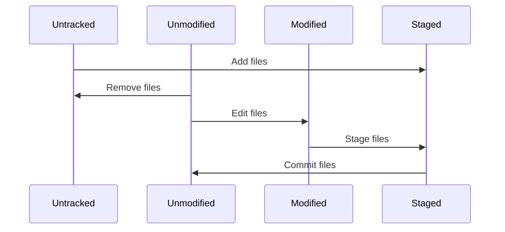

# 1. Revision

**하나 가리키기**

`git show {sha-1}` : 해시값으로 커밋 조회

**브랜치로 가리키기**

`git show {브랜치@{n | 시간}}` : 브랜치가 가리키고 있는 n 번째 또는 시간과 일치하는 커밋 조회

→ 브랜치가 가리키는 SHA-1값은 `git rev-parse {브랜치}` 로 조회 가능

**reflog로 가리키기**

`git reflog` : HEAD, branch가 가리킨 커밋 로그를 조회

→ HEAD의 포인트 변경점: commit checkout reset merge rebase cherrypick 등등

**계통 관계로 가리키기(^, ~)**

`git show HEAD^3` : 증조부모의 merge commit을 조회

`git show HEAD^^^` | `git show HEAD~3`: 증조부모 커밋을 조회

`git show HEAD~3^2` : 증조부모의 merge commit의 부모의 부모를 조회

**범위로 가리키기(double dot, triple dot)**

`git log A..B`  : A에는 없지만, B에는 있는 커밋 조회

`git log A…B`  : A와 B의 차집합의 커밋 조회

`git log A B ^C` |  `git log A B --not C` : A와 B에 있지만 C에 없는 커밋 조회

# 2. Interactive Mode

`git status` : 현재 파일 상태 확인하기



`git add -i` : staging Area 선별하기 위한 대화형 모드

```
➜  goodoc-web-therapist-admin git:(develop) ✗ git add -i
     스테이징 안스테이징 경로
  1:       +0/-13       없음 src/components/forms/Select/SelectMenu/index.css.ts
  2:       +0/-26       없음 src/components/forms/Select/SelectMenu/index.tsx
  3:       +0/-10       없음 src/components/forms/Select/SelectMenu/types.ts
  4:       +0/-41       없음 src/components/forms/Select/SelectMenuItem/index.css.ts
  5:       +0/-27       없음 src/components/forms/Select/SelectMenuItem/index.tsx
  6:       +0/-17       없음 src/components/forms/Select/SelectMenuItem/types.ts

*** Commands ***
  1: status	  2: update	  3: revert	  4: add untracked
  5: patch	  6: diff	  7: quit	  8: help
What now>
```

- update: 선택한 파일을 staging area로 이동
- revert: 선택한 파일을 unstaging area로 이동
- diff: 선택한 staged 파일의 변경내용 확인
- patch: 파일의 일부분만 staging area로 이동

# 3. Stash

`git stash` : 현재 작업중인 파일들을 stashdp 저장

- list: stash 리스트 조회
- push: git stash와 동일, save → push 대체
- apply stash@{n}: n번 stash 이름으로 골라서 적용, 이름이 없으면 가장 최근 꺼 적용
    - —index를 같이 사용하면 staged된 상태 적용
- drop stash@{n}: n번 stash 이름으로 골라서 제거, 이름이 없으면 가장 최근 꺼 적용
- pop: apply 이후 바로 스택에서 제거
- branch {브랜치} : stash를 적용한 브랜치 생성

`git clean` : untracked 상태의 파일을 삭제

- -f : 강제로 실행
- -i: 대화형 모드
- -x: 무시된 파일까지 실행
- -n: 미리 결과 확인 가능

# 4. Search

`git grep` : 문자열, 정규식으로 커밋 트리의 내용이나 워킹 디렉토리의 내용을 검색

`git log`: 커밋 기록 조회

- -S {문자열}: 해당 문자열이 추가,제거된 커밋을 검색
- -G: 세세한 조건으로 검색, 정규식으로 검색
- -L :{함수명 | 정규식}:{파일명} : 함수나 라인 등 히스토리를 조회

# 5. Rewrite History

git은 로컬에 모든 버전관리 데이터를 복사 해두고 있다. 따라서 함부로 push 하는 행동은 지양해야한다.

```powershell
# 수정하기
git commit --amend // 가장 최근 커밋 수정
git commit --amend --no-edit // 커밋 메세지를 수정

# 한번에 여러개 수정하기
git rebase -i HEAD~3 // 최근 3개의 커밋을 수정
파일편집기에서 pick -> commands 중 하나로 변경하여 수정(edit, reword), 순서 변경 및 삭제 가능, 합치기(squash, fixup) 가능
 
pick f7f3f6d changed my name a bit
pick 310154e updated README formatting and added blame
pick a5f4a0d added cat-file

# Rebase 710f0f8..a5f4a0d onto 710f0f8
#
# Commands:
#  p, pick = use commit
#  r, reword = use commit, but edit the commit message
#  e, edit = use commit, but stop for amending
#  s, squash = use commit, but meld into previous commit
#  f, fixup = like "squash", but discard this commit's log message
#  x, exec = run command (the rest of the line) using shell
#
# These lines can be re-ordered; they are executed from top to bottom.
#
# If you remove a line here THAT COMMIT WILL BE LOST.
#
# However, if you remove everything, the rebase will be aborted.
#
# Note that empty commits are commented out

git commit --amend // 해당 커밋 수정
git rebase --continue // 해당 커밋 적용

# 분리하기
git rebase -i HEAD~3

pick f7f3f6d changed my name a bit
edit 310154e updated README formatting and added blame // edit으로 변경
pick a5f4a0d added cat-file

git reset HEAD^ // 커밋 해제
git add README // README 파일 staging area 이동
git commit -m 'updated README formatting' // updated README formatting 커밋
git add lib/simplegit.rb 
git commit -m 'added blame'
git rebase --continue
```

git config 이메일 이름 설정하는거를 까먹었을때 내정보로 변경하도록 모두 수정 가능

```
git filter-branch --commit-filter '
        if [ "$GIT_AUTHOR_EMAIL" = "schacon@localhost" ];
        then
                GIT_AUTHOR_NAME="Scott Chacon";
                GIT_AUTHOR_EMAIL="schacon@example.com";
                git commit-tree "$@";
        else
                git commit-tree "$@";
        fi' HEAD
```

# 6. Bisect

`git blame` : 각 라인을 누가 언제 마지막으로 고쳤는지 찾기 위함

- -L: 라인을 제한하여 부분 확인 가능
    - sha-1 값 앞에 ^ 가 붙으면 처음 커밋 되었다는 것을 의미
- -C: 원래 어떤 파일로 커밋됐는지 확인 가능

`git bisect`: 광범위한 버그가 있는 커밋을 찾을 때 사용

- start: 이진 탐색으로 시작
- good {coommit}: 문제가 없는 커밋 표시
- bad: 문제가 있는 커밋 표시
- reset: start 시점으로 HEAD를 이동
